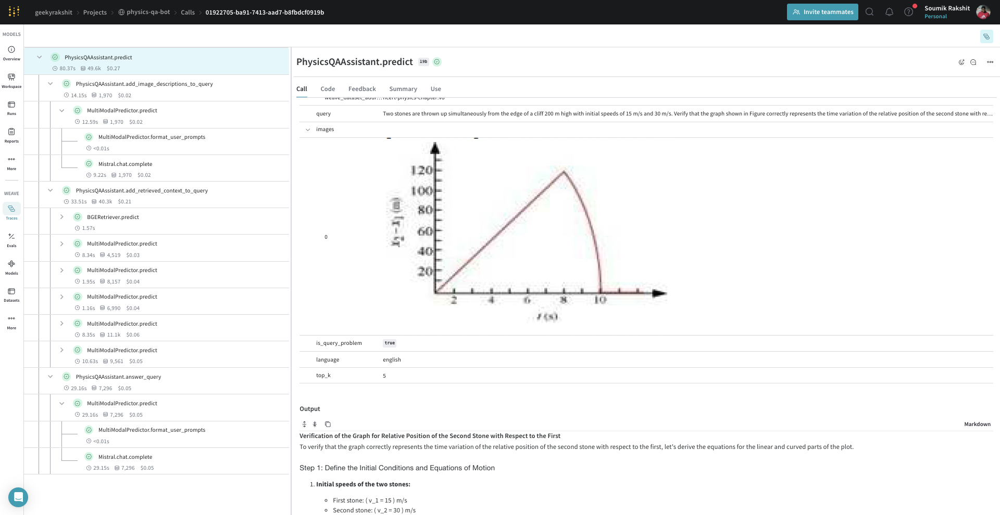

# Physics QA-Bot

A multi-modal Physic question-answering bot. The code in this repository is based on the course
[RAG++ : From POC to Production](https://www.wandb.courses/courses/rag-in-production).

## Installation

Install dependencies using the following commands:

```bash
git clone https://github.com/soumik12345/physics-qa-bot
cd physics-qa-bot
pip install -U pip uv
uv pip install torch --index-url https://download.pytorch.org/whl/cpu
uv sync
```

Next, you need to activate the virtual environment:

```bash
source .venv/bin/activate
```

Finally, you need to get a MistralAI and OpenAI API keys (depending on which model you use).

## Usage

First, you need to create the document chunks from the PDF documents using a multi-modal model like
[Pixtral](https://docs.mistral.ai/capabilities/vision/) or [GPT-4o](https://platform.openai.com/docs/models/gpt-4o).

```python
import weave

import wandb
from physics_qa_bot.document_loader import TextExtractionModel
from physics_qa_bot.llm_wrapper import MultiModalPredictor

wandb.init(project="physics-qa-bot", entity="geekyrakshit")
weave.init(project_name="geekyrakshit/physics-qa-bot")
text_extraction_model = TextExtractionModel(
    documents_artifact_address="geekyrakshit/physics-qa-bot/ncert-physics-documents:latest",
    predictor=MultiModalPredictor(model_name="pixtral-12b-2409"),
)
text_extraction_model.predict(weave_dataset_name="ncert-physics-chapter")
```

Once you have the document chunks, you can use the following code to create a retriever and assistant respectively:

```python
import weave
from PIL import Image

from physics_qa_bot.assistant import PhysicsQAAssistant
from physics_qa_bot.retriever import BGERetriever

weave.init(project_name="geekyrakshit/physics-qa-bot")
retriever = BGERetriever(
    weave_dataset_address="ncert-physics-chapter:v8",
    model_name="BAAI/bge-small-en-v1.5",
)
assistant = PhysicsQAAssistant(
    multi_modal_query_model="pixtral-12b-2409",
    math_query_model="mistral-large-latest",
    text_query_model="mistral-small-latest",
    retriever=retriever,
    weave_dataset_address="ncert-physics-chapter:v8",
)
assistant.predict(
    query="""
Two stones are thrown up simultaneously from the edge of a cliff 200 m high with
initial speeds of 15 m/s and 30 m/s. Verify that the graph shown in Figure correctly
represents the time variation of the relative position of the second stone with respect
to the first. Neglect air resistance and assume that the stones do not rebound after
hitting the ground. Take g = 10 m/s^2. Give the equations for the linear and curved
parts of the plot.
""",
    images=[Image.open("./dataset/diagram_1.png")],
    is_query_problem=True,
)
```

|                               |
|------------------------------------------------------------|
| Here's how a [Weave](https://wandb.ai/geekyrakshit/physics-qa-bot/weave/calls/01922705-ba91-7413-aad7-b8fbdcf0919b) trace from the assistant looks like |